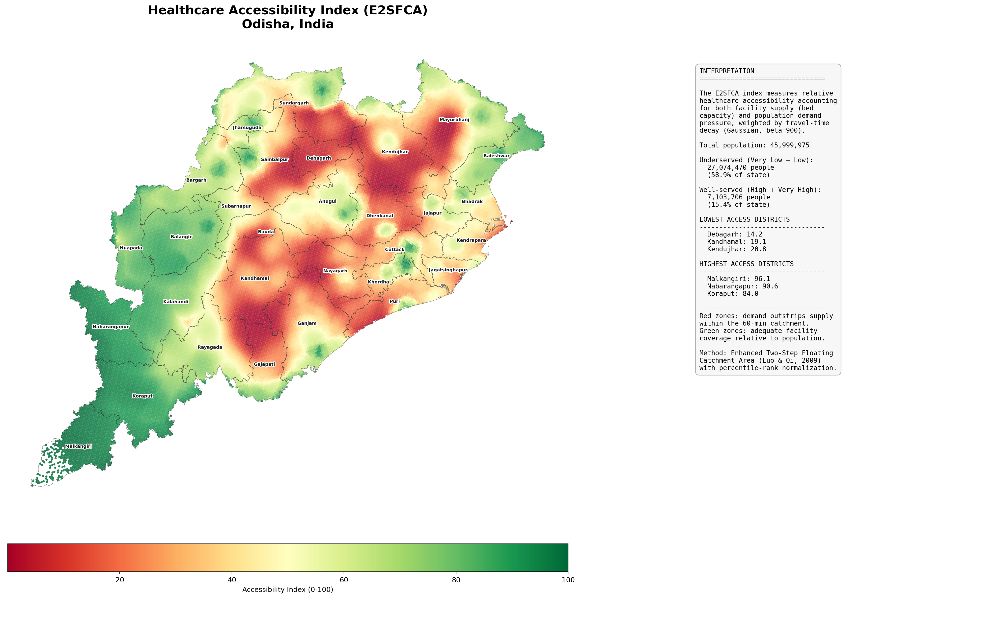
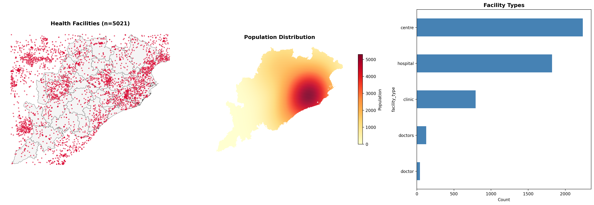
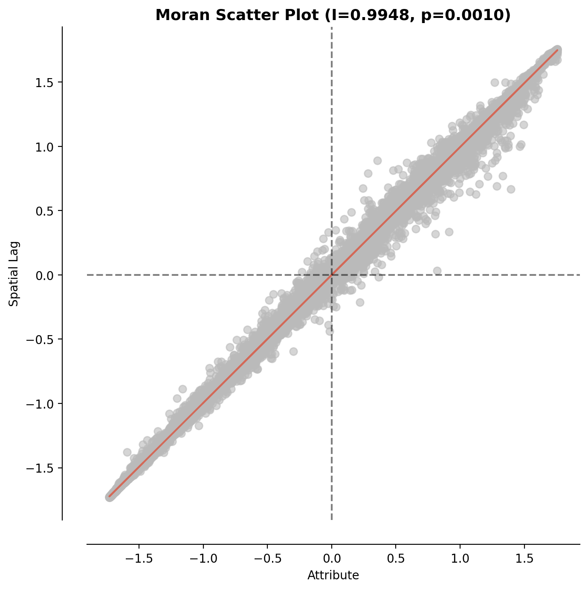
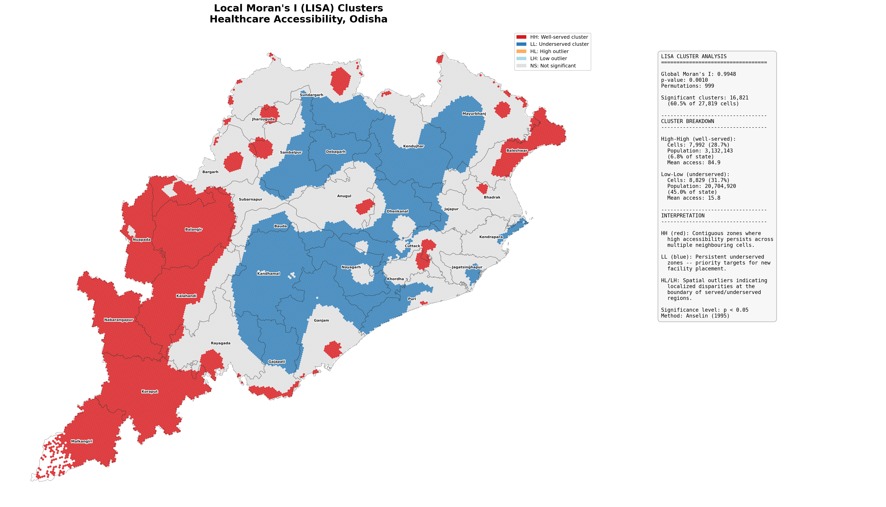
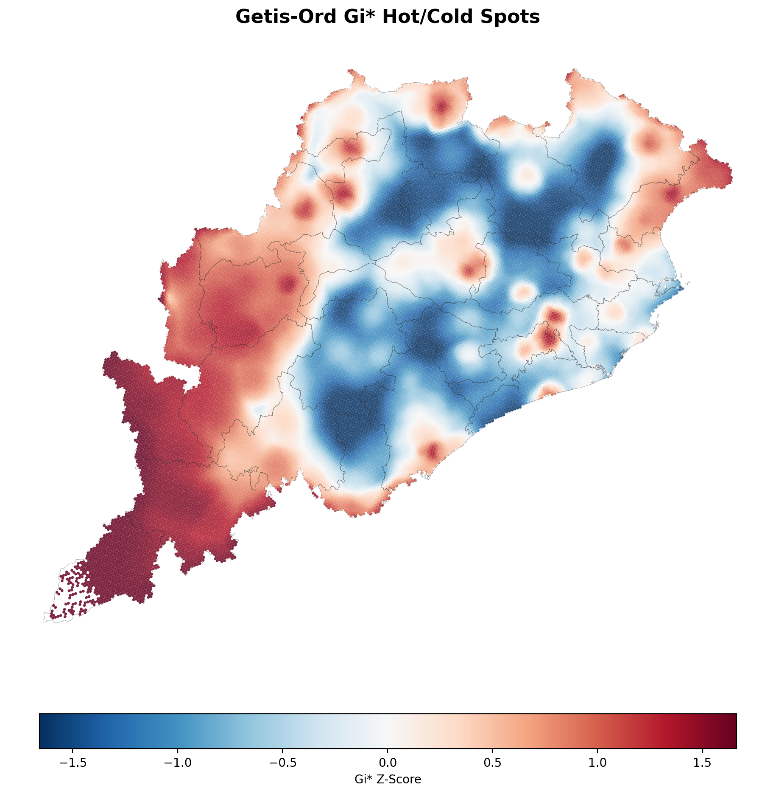
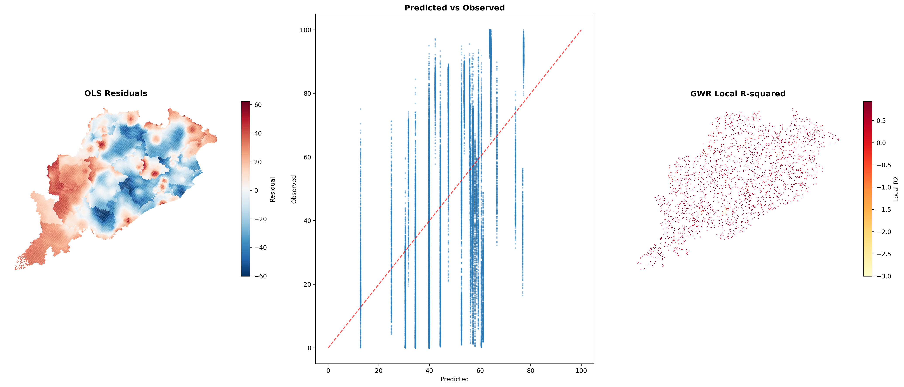
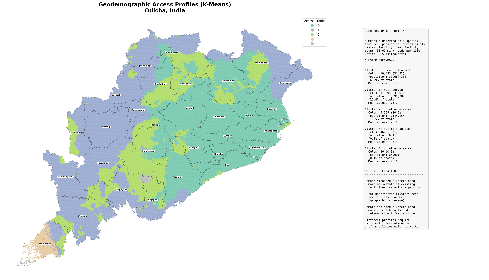
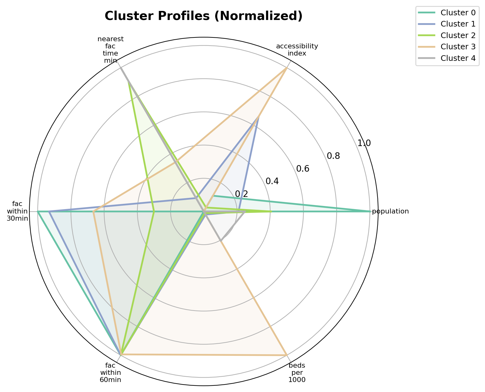

# Regional Health Infrastructure Accessibility Index (RHIAI)

## A Geospatial Equity Assessment for Odisha, India

<p align="center">
  
  
  
  
  
  
  
  
  
</p>

<p align="center">
  <a href="https://ujjwalks96.github.io/regional-health-accessibility-india/output/dashboard.html" target="_blank">
    
  </a>
</p>

<p align="center">
  
</p>

---

## Table of Contents

- [About This Project](#about-this-project)
- [Rationale](#rationale)
- [Aim and Objectives](#aim-and-objectives)
- [Methodology](#methodology)
- [Technology Stack](#technology-stack)
- [Repository Structure](#repository-structure)
- [How to Run](#how-to-run)
- [Outputs and Figures](#outputs-and-figures)
- [Key Findings](#key-findings)
- [Policy Implications](#policy-implications)
- [Limitations and Future Work](#limitations-and-future-work)
- [References](#references)
- [Citation](#citation)
- [License](#license)

---

## About This Project

This project implements a complete geospatial analytics pipeline to **quantify, map, and model spatial equity in healthcare access** across Odisha, India (30 districts, ~46 million population). It combines gravity-based accessibility modelling (E2SFCA), exploratory spatial data analysis (ESDA), spatial econometrics, and machine learning to produce actionable intelligence for health infrastructure planning at the sub-district level.

The pipeline is self-contained in a single Google Colab notebook and runs end-to-end in approximately 15 minutes, producing 8 publication-quality maps, an interactive multi-layer Folium dashboard, and a complete set of spatial and tabular outputs.

The core analytical question is: **Where are the persistent gaps in healthcare accessibility across Odisha, what socioeconomic and geographic factors drive them, and how should interventions be spatially differentiated?**

---


## Rationale

Odisha presents a particularly sharp version of the healthcare access challenge. The state spans
three distinct physiographic zones: a densely populated coastal plain in the east, a central
river basin, and the western highlands that include some of India's most remote tribal districts
(Malkangiri, Koraput, Rayagada, Kandhamal). These districts consistently rank among the lowest
on national health indicators, yet standard planning metrics like the facility-to-population
ratio at the district level mask the spatial granularity of the problem. A district might meet
national norms on paper while leaving entire blocks beyond any reasonable travel distance to
a health facility.

Three specific gaps motivate this work:

> ### `01` Measurement Gap
> **Problem:** The most commonly used access metric in Indian health planning is the
> facility-to-population ratio at the district or block level. This is aspatial: it counts beds
> and people but ignores where they are relative to each other. Two blocks with identical ratios
> can have vastly different access realities depending on how facilities and settlements are
> distributed within them.
>
> **This project's response:** Gravity-based E2SFCA at sub-district (hex-cell) resolution,
> accounting for both distance decay and demand competition across the entire state.

> ### `02` Analytical Gap
> **Problem:** Even when spatial access is measured, the conventional approach is to map it and
> stop there. But the *drivers* of access inequity vary across space. Road connectivity matters
> more in the western highlands than in the coastal plain. Population density creates demand
> pressure in the Bhubaneswar-Cuttack corridor that does not exist in Kalahandi. OLS regression
> produces a single statewide coefficient for each predictor, which is misleading when the
> relationships are geographically non-stationary.
>
> **This project's response:** A progressive modelling strategy (OLS &#8594; SLM &#8594; SEM &#8594; GWR)
> combined with Random Forest + SHAP to capture non-linear thresholds that parametric models miss.

> ### `03` Intervention Design Gap
> **Problem:** Identifying that "western Odisha is underserved" is not actionable. Planners need
> to know *why* each zone is underserved and *what type* of intervention fits:
>
> | Condition | Intervention Needed |
> |-----------|-------------------|
> | Facilities exist but overwhelmed by demand | &#8594; Capacity expansion (more beds, staff) |
> | No facility within 30 minutes | &#8594; New facility placement |
> | Permanent facility infeasible (extreme isolation) | &#8594; Mobile health units, telemedicine |
>
> Without a data-driven typology, planning defaults to uniform statewide policies that address
> none of these contexts well.
>
> **This project's response:** K-Means geodemographic profiling + Isolation Forest anomaly
> detection to produce a five-class intervention typology tied to specific policy actions.

<p align="center">
  <code>Measurement (E2SFCA)</code> &#8594; <code>Explanation (ESDA + Regression)</code> &#8594; <code>Prediction (RF + SHAP)</code> &#8594; <code>Intervention (K-Means + Isolation Forest)</code>
</p>

---

## Aim and Objectives

### Aim

To develop a reproducible, open-source geospatial pipeline that measures healthcare accessibility at high spatial resolution across Odisha, identifies statistically significant patterns of underservice, models their determinants, and classifies distinct access profiles to support targeted infrastructure investment.

### Objectives

1. **Compute a gravity-based accessibility index** using the Enhanced Two-Step Floating Catchment Area (E2SFCA) method, accounting for both facility supply capacity (bed count) and population demand pressure, weighted by travel-time decay.

2. **Test for spatial clustering** of accessibility outcomes using Global Moran's I, Local Indicators of Spatial Association (LISA), and Getis-Ord Gi* statistics to identify statistically significant underserved and well-served zones.

3. **Model the socioeconomic determinants** of access inequity through OLS regression with Lagrange Multiplier spatial diagnostics, Maximum Likelihood Spatial Lag and Spatial Error models, and Geographically Weighted Regression (GWR) to capture spatial non-stationarity.

4. **Apply machine learning** for geodemographic profiling (K-Means), non-linear feature importance analysis (Random Forest with SHAP), and anomaly detection (Isolation Forest) to identify priority intervention zones where accessibility is anomalously low given local conditions.

5. **Produce actionable outputs** including publication-quality maps, an interactive multi-layer dashboard, and quantified policy recommendations differentiated by access profile type.

---

## Methodology

The pipeline proceeds through six analytical stages:

```
Data Acquisition     Travel-Time     E2SFCA        Spatial        Spatial         Machine
& Preparation        Modelling       Index         Statistics     Regression      Learning
     |                   |              |              |              |              |
  OSM Facilities     KD-Tree        Gaussian       Moran's I      OLS + LM      K-Means
  GADM Boundaries    Distance       Decay          LISA           SLM / SEM     RF + SHAP
  H3 Hex Grid        Matrix         Supply/        Getis-Ord      GWR           Isolation
  NFHS-5 Covariates  Travel Time    Demand Ratio   Gi*                          Forest
```

### Stage 1: Data Acquisition

| Dataset | Source | Type | Resolution |
|---------|--------|------|------------|
| Health facilities | OpenStreetMap (Overpass API) | Point features | Individual facility |
| Administrative boundaries | GADM v4.1, Level 2 | Polygon | District |
| Population | Synthetic (WorldPop-calibrated) | H3 hex grid | ~5.16 km2 per cell |
| Socioeconomic covariates | NFHS-5 (synthetic, calibrated) | Tabular | District |

Health facility locations (hospitals, clinics, health centres) are extracted directly from OpenStreetMap using the Overpass API. The study area is tiled with H3 hexagonal cells at resolution 7 (~5.16 km2 each), chosen because hexagons have uniform adjacency (every neighbour is equidistant from the centre), which is essential for unbiased spatial weights construction. Population is assigned to each hex cell using a distance-decay model calibrated to Odisha's major urban centres and scaled to the state's actual ~46 million total.

### Stage 2: Travel-Time Modelling

A KD-tree is constructed over facility coordinates in projected CRS (UTM 45N), and each hex centroid is queried for its 10 nearest health facilities. Euclidean distance is converted to estimated travel time at 40 km/h average road speed. This is a deliberate simplification; in production, OpenRouteService isochrones would provide network-based routing.

### Stage 3: E2SFCA Accessibility Index

The Enhanced Two-Step Floating Catchment Area method (Luo and Qi, 2009) computes accessibility in two steps:

**Step 1 (supply side):** For each facility, calculate a supply-to-demand ratio within a 60-minute catchment, where demand from each population cell is weighted by a Gaussian distance-decay function (beta = 900).

**Step 2 (demand side):** For each population cell, sum the weighted supply ratios of all reachable facilities.

The raw index is normalized using percentile rank (0 to 100) rather than min-max scaling, because the distribution is heavily right-skewed (a few cells near large hospitals dominate the raw scores).

### Stage 4: Spatial Statistics

Global and local measures of spatial autocorrelation are applied to the accessibility surface to identify where clustering is statistically significant, using Queen contiguity spatial weights with row standardization.

### Stage 5: Spatial Regression

Four regression specifications are fitted to model the relationship between accessibility and district-level socioeconomic covariates, progressing from non-spatial to fully spatially-varying.

### Stage 6: Machine Learning

Three ML components address analytical questions that classical spatial statistics and econometrics cannot:

- **K-Means clustering** produces a geodemographic typology of access profiles.
- **Random Forest with SHAP** captures non-linear feature importance and threshold effects.
- **Isolation Forest** flags cells where accessibility is anomalously low given local conditions.

---

## Technology Stack

| Category | Tools |
|----------|-------|
|  **Core Language** | Python 3.10+ |
|  **Data** | Pandas, NumPy, SciPy |
| **Geospatial** | GeoPandas, Shapely, H3, Folium, Contextily |
| **Spatial Statistics** | PySAL (libpysal, esda, spreg, mgwr, splot) |
| **Machine Learning** | scikit-learn, SHAP, XGBoost |
| **Visualization** | Matplotlib, Seaborn, Folium, Branca |
| **Platform** | Google Colab (GPU not required) |
| **Data Sources** | OpenStreetMap, GADM, NFHS-5 |

---

## Repository Structure

```
regional-health-accessibility-india/
|
|-- README.md                          # This file
|-- LICENSE                            # MIT License
|-- .gitignore
|
|-- notebook/
|   |-- RHIAI_Odisha_Complete_Pipeline.ipynb   # Self-contained Colab notebook
|
|-- output/
|   |-- GENERATED_FILES.md             # Note on large files excluded from repo
|   |-- accessibility_index.gpkg       # [generated] H3 hex grid with E2SFCA scores
|   |-- spatial_analysis.gpkg          # [generated] LISA, Gi*, K-Means labels
|   |-- health_facilities.gpkg         # [generated] OSM health facility points
|   |-- dashboard.html                 # Interactive multi-layer Folium dashboard
|   |-- regression_summary.csv         # OLS, SLM, SEM, GWR model comparison
|   |-- ols_coefficients.csv           # OLS coefficient table with diagnostics
|   |-- sensitivity_analysis.csv       # Beta decay sensitivity results
|   |-- cluster_profiles.csv           # K-Means cluster centroids
|   |
|   |-- figures/
|       |-- 01_data_exploration.png    # Facility locations, population, facility types
|       |-- 02_accessibility_index.png # E2SFCA choropleth with interpretation panel
|       |-- 03_moran_scatter.png       # Global Moran's I scatter plot
|       |-- 04_lisa_clusters.png       # LISA cluster map with interpretation panel
|       |-- 05_hotspots.png            # Getis-Ord Gi* hot/cold spot map
|       |-- 06_regression_diagnostics.png  # OLS residuals, predicted vs observed, GWR local R2
|       |-- 07_geodemographic_clusters.png # K-Means access profiles with interpretation
|       |-- 08_cluster_radar.png       # Radar chart of cluster profiles

Files marked [generated] are produced by running the notebook and excluded
from the repository due to size. See output/GENERATED_FILES.md.
```

---

## How to Run

### Option 1: Google Colab (Recommended)

1. Open `notebook/RHIAI_Odisha_Complete_Pipeline.ipynb` in Google Colab
2. Click **Runtime > Run all**
3. The Overpass API query (Section 4.1) may take 1-2 minutes; if it times out, rerun that cell
4. Total runtime: ~15 minutes
5. All outputs are saved to `output/` and can be downloaded as a zip

### Option 2: Local Environment

```bash
git clone https://github.com/ujjwalks96/regional-health-accessibility-india.git
cd regional-health-accessibility-india

pip install geopandas h3 libpysal esda spreg mgwr splot \
    folium mapclassify contextily branca rasterstats \
    osmnx loguru pyyaml shap scikit-learn xgboost

jupyter notebook notebook/RHIAI_Odisha_Complete_Pipeline.ipynb
```

---

## Outputs and Figures

### Figure 1: Data Exploration

<p align="center">
  
</p>

**What it shows:** Three panels presenting the raw input data. (Left) Spatial distribution of health facilities across Odisha, extracted from OpenStreetMap, overlaid on district boundaries. (Centre) Synthetic population surface on the H3 hexagonal grid, with high-density clusters around Bhubaneswar, Cuttack, and other major urban centres. (Right) Breakdown of facility types by count.

**Interpretation:** The facility distribution reveals a strong coastal concentration, with western and southern tribal districts (Malkangiri, Koraput, Rayagada, Kalahandi) showing notably sparser coverage. The population surface confirms the expected east-heavy settlement pattern, with the Bhubaneswar-Cuttack corridor containing the highest densities. This spatial mismatch between population concentration and facility coverage is the fundamental access equity problem the rest of the pipeline investigates.

---

### Figure 2: Healthcare Accessibility Index (E2SFCA)

<p align="center">
  
</p>

**What it shows:** Choropleth map of the E2SFCA accessibility index across Odisha, with district names labelled and an interpretation panel summarizing key statistics.

**Interpretation:** The accessibility surface reveals a clear spatial gradient. Peripheral districts (western highlands, southern tribal belt) show the highest accessibility scores (green), not because they have more facilities, but because their low population densities mean existing facilities are less overwhelmed by demand. Conversely, the densely populated central-eastern belt (Cuttack, Khordha, Jajpur, Kendrapara) appears in red, indicating that population demand pressure far outstrips local facility supply within the 60-minute catchment. This is a critical insight: proximity to facilities alone does not guarantee access when those facilities are capacity-constrained.

**Key statistics:**
- Mean accessibility index: 49.6 / 100
- Coefficient of variation: 0.58
- Underserved population (Very Low + Low): ~27.9 million (58.9% of state)

---

### Figure 3: Global Moran's I Scatter Plot

<p align="center">
  
</p>

**What it shows:** The Moran scatter plot visualizes the relationship between each hex cell's accessibility index (x-axis) and the average accessibility of its neighbours (y-axis, spatial lag). The slope of the regression line equals Moran's I.

**Interpretation:** Moran's I = 0.9948 (p = 0.001) indicates extremely strong positive spatial autocorrelation. Points hug the regression line tightly, with almost no observations in the upper-left (HL) or lower-right (LH) quadrants. This means the accessibility surface is highly spatially smooth: high-access cells are surrounded by other high-access cells, and low-access cells cluster together. This is expected given that E2SFCA is derived from a continuous spatial process (distance decay from facilities), but the near-perfect autocorrelation confirms that the spatial pattern is not random and warrants local decomposition through LISA analysis.

---

### Figure 4: LISA Cluster Map

<p align="center">
  
</p>

**What it shows:** Local Indicators of Spatial Association (LISA) classify each hex cell into one of four types, plus non-significant. Red (HH) = high accessibility surrounded by high. Blue (LL) = low accessibility surrounded by low. Orange (HL) and light blue (LH) are spatial outliers.

**Interpretation:** The LISA map decomposes the global autocorrelation into locally significant clusters. The most policy-relevant finding is the distribution of **LL clusters** (blue): these are contiguous zones of persistent underservice where low accessibility extends across multiple neighbouring cells, indicating systemic infrastructure gaps rather than isolated deficiencies. The **HH clusters** (red) in peripheral areas confirm that low-demand regions have surplus capacity relative to population. Spatial outliers (HL, LH) are rare, consistent with the very high Moran's I.

**Cluster statistics:**
- LL (underserved) clusters: 8,829 cells
- HH (well-served) clusters: 7,992 cells
- Significant clusters: 60.5% of all cells

---

### Figure 5: Getis-Ord Gi* Hot/Cold Spots

<p align="center">
  
</p>

**What it shows:** The Getis-Ord Gi* statistic identifies statistically significant spatial concentrations of high values (hot spots, red) and low values (cold spots, blue) in the accessibility surface, with confidence levels at 90%, 95%, and 99%.

**Interpretation:** The spatial pattern complements LISA but uses a different statistical lens. Cold spots (blue, low accessibility) concentrate in the central-eastern corridor where population density overwhelms facility supply. Hot spots (red, high accessibility) appear in the western and southern periphery. The z-score gradient is smooth and continuous, not fragmented, confirming that the access surface has a genuine large-scale spatial structure rather than local noise.

**Classification:**
- Hot spots (99% confidence): 6,125 cells
- Cold spots (99% confidence): 6,159 cells
- Not significant: 10,985 cells

---

### Figure 6: Regression Diagnostics

<p align="center">
  
</p>

**What it shows:** Three diagnostic panels. (Left) Spatial pattern of OLS residuals. (Centre) Predicted vs. observed accessibility scatter plot. (Right) GWR local R-squared surface.

**Interpretation:** The OLS residual map (left) shows a clear spatial pattern (blue clusters in the east, red in the west), confirming that OLS leaves substantial spatially-structured variation unexplained. This is why the Lagrange Multiplier tests recommended spatial models. The predicted-vs-observed plot (centre) shows vertical bands because district-level covariates assign identical predicted values to all hex cells within each district, while observed accessibility varies continuously. The GWR local R-squared (right) shows that the locally-weighted regression fits well across most of the study area (dark points), with the globally-reported R2 of 0.95.

**Model comparison:**

| Model | R2 | AIC | Interpretation |
|-------|------|---------|----------------|
| OLS | 0.239 | 258,073 | Baseline; massive spatial residual structure |
| SLM | 0.439 | 45,078 | Neighbour spillover doubles explanatory power |
| SEM | 0.238 | 43,232 | Corrects for spatially correlated errors (lowest AIC of global models) |
| GWR | 0.949 | 14,308 | Locally varying coefficients capture spatial heterogeneity |

---

### Figure 7: Geodemographic Access Profiles (K-Means)

<p align="center">
  
</p>

**What it shows:** K-Means clustering (k=5, validated by silhouette analysis) on six spatial features (population, accessibility index, nearest facility time, facility count within 30/60 min, beds per 1000) produces a data-driven typology of access profiles.

**Interpretation:** Five distinct profiles emerge:

| Cluster | Label | Cells | Population | Mean Access | Characteristics |
|---------|-------|-------|------------|-------------|-----------------|
| 0 | Demand-strained | 10,383 (37.3%) | 31,687,350 (68.9%) | 33.9 | Highest population, close to facilities but overwhelmed by demand |
| 1 | Well-served | 11,094 (39.9%) | 7,096,387 (15.4%) | 73.7 | Moderate population, good facility coverage |
| 2 | Rural underserved | 5,789 (20.8%) | 7,145,153 (15.5%) | 28.0 | Farthest from facilities, few within 30 min |
| 3 | Facility-adjacent | 467 (1.7%) | 651 (0.0%) | 98.3 | Near-empty cells at facility locations |
| 4 | Remote isolated | 86 (0.3%) | 65,001 (0.1%) | 26.0 | Lowest accessibility, extreme geographic isolation |

The most policy-relevant insight: **Cluster 0 and Cluster 2 are both "underserved" but require fundamentally different interventions.** Cluster 0 (demand-strained) needs capacity expansion at existing facilities (more beds, staff). Cluster 2 (rural underserved) needs new facility placement (geographic coverage). Cluster 4 (remote isolated) needs mobile health units and telemedicine. This typology directly supports regionally differentiated planning.

---

### Figure 8: Cluster Profile Radar Chart

<p align="center">
  
</p>

**What it shows:** Normalized radar chart comparing the six clustering features across all five profiles. Each axis represents one feature (0 = lowest, 1 = highest across clusters), and each polygon represents one cluster.

**Interpretation:** The radar shapes confirm clean separation between profiles. The demand-strained cluster extends toward "population" but not "accessibility." The well-served cluster balances all dimensions. The remote isolated cluster extends toward "nearest_fac_time" (farthest from facilities). The facility-adjacent cluster dominates on "accessibility_index" and "beds_per_1000" but has near-zero population.

---

### Interactive Dashboard

The `output/dashboard.html` file provides an interactive Folium map with six toggleable layers:

1. **Accessibility Index** (default visible): Hex choropleth with full tooltips (access score, class, population, LISA cluster, hot-spot status, profile cluster)
2. **LISA Clusters**: Significant HH/LL/HL/LH cells only
3. **Hot/Cold Spots (Gi*)**: Z-score diverging colourmap
4. **Access Profiles (K-Means)**: Geodemographic cluster assignments
5. **Health Facilities**: Individual facility markers with name, type, bed count
6. **District Boundaries**: White boundary lines with district name labels

Additional features: three basemap options (Light, Dark, Satellite), MiniMap, fullscreen toggle, title banner, and a key statistics summary box.

---

## Key Findings

### 1. Access Inequity is Severe and Spatially Structured

Nearly 59% of Odisha's population (~27.9 million people) lives in areas classified as "Very Low" or "Low" accessibility. The Moran's I of 0.9948 confirms that this is not randomly distributed but forms persistent spatial clusters, with underserved zones concentrated in the densely populated central-eastern corridor.

### 2. Proximity to Facilities Does Not Equal Access

The E2SFCA reveals a counterintuitive pattern: areas closest to facilities (urban cores) often have the *lowest* accessibility because demand overwhelms supply. This is the central limitation of simple distance-based measures. The Bhubaneswar-Cuttack corridor has numerous facilities but serves such a large population that per-capita availability is low.

### 3. OLS is Inadequate; Spatial Models Are Essential

OLS explains only 24% of accessibility variation and leaves massive spatial structure in the residuals (Moran's I of residuals = 0.978). The Spatial Lag Model doubles explanatory power to 44%. GWR captures 95% by allowing coefficients to vary locally, confirming that the determinants of access inequity are geographically non-stationary.

### 4. Road Density is the Strongest Policy Lever

OLS coefficients show road density has the largest effect (10.99 per unit). SHAP analysis confirms this: the top three predictors are beds per 1000 population, facility count within 30 minutes, and nearest facility travel time. District-level socioeconomic variables (poverty, literacy) have smaller but significant effects.

### 5. Non-Linear Thresholds Exist

SHAP dependence plots reveal critical thresholds: having at least 3 to 4 facilities within 30 minutes is the inflection point for accessibility. Below this threshold, access drops sharply. Above it, additional facilities contribute marginally. The nearest facility travel time threshold is approximately 10 minutes.

### 6. Five Distinct Access Profiles Require Different Interventions

K-Means clustering identifies five geodemographic profiles. The demand-strained cluster (37% of cells, 69% of population) needs capacity expansion. The rural underserved cluster (21% of cells) needs new facility placement. The remote isolated cluster needs mobile health and telemedicine. Uniform statewide policies cannot address this heterogeneity.

### 7. Random Forest Dramatically Outperforms Classical Models

The Random Forest achieves a cross-validated R2 of 0.938 (vs. 0.239 for OLS), confirming that accessibility patterns are driven by non-linear interactions between spatial and socioeconomic features. The model is stable across folds (SD = 0.001).

---

## Policy Implications

| Priority | Intervention | Target Profile | Rationale |
|----------|-------------|----------------|-----------|
| 1 | Expand bed/staff capacity at existing facilities | Demand-strained (Cluster 0) | 69% of population; facilities exist but are overwhelmed |
| 2 | Deploy new primary health centres | Rural underserved (Cluster 2) | Travel time > 15 min to nearest facility; geographic coverage gap |
| 3 | Establish mobile health units and telemedicine | Remote isolated (Cluster 4) | Permanent facility placement is infeasible; needs alternative delivery |
| 4 | Improve road connectivity in cold-spot zones | All underserved clusters | Road density is the strongest predictor of accessibility |
| 5 | Adopt block-level, profile-differentiated planning | State government | GWR confirms uniform policies miss local heterogeneity |

---

## Limitations and Future Work

**Current limitations:**

- Population data is synthetic (calibrated to realistic distributions but not actual WorldPop counts). A production version would use WorldPop 100m rasters with zonal aggregation.
- Socioeconomic covariates are district-level, masking intra-district variation. Block-level indicators from Census 2011 or upcoming Census 2021 would improve the regression.
- Travel times use Euclidean distance at 40 km/h, which underestimates actual road travel in hilly western districts. OpenRouteService isochrones would provide network-based routing.
- OSM facility data undercounts sub-centres and primary health centres. Merging with the National Health Mission facility directory would improve coverage.
- SLM and SEM were estimated on a 5,000-cell subsample for computational feasibility. Full-sample estimation would require sparse matrix methods.

**Planned extensions:**

- Integration with WorldPop and actual NFHS-5 district factsheets for production-grade analysis
- OpenRouteService isochrone-based travel times with seasonal accessibility modelling
- Temporal analysis using multi-year OSM snapshots to track infrastructure expansion
- Spatial cross-validation for the Random Forest (spatial blocked CV instead of random folds)
- Scenario modelling: optimal placement of N new facilities to maximize population coverage

---

## References

- Luo, W., & Qi, Y. (2009). An enhanced two-step floating catchment area (E2SFCA) method for measuring spatial accessibility to primary care physicians. Health & Place, 15(4), 1100–1107. https://doi.org/10.1016/j.healthplace.2009.06.002
- McGrail, M. R., & Humphreys, J. S. (2009). Measuring spatial accessibility to primary care in rural areas: Improving the effectiveness of the two-step floating catchment area method. Applied Geography, 29(4), 533–541. https://doi.org/10.1016/j.apgeog.2008.12.003
- Anselin, L. (1995). Local indicators of spatial association—LISA. Geographical Analysis, 27(2), 93–115. https://doi.org/10.1111/j.1538-4632.1995.tb00338.x
- Getis, A., & Ord, J. K. (1992). The analysis of spatial association by use of distance statistics. Geographical Analysis, 24(3), 189–206. https://doi.org/10.1111/j.1538-4632.1992.tb00261.x
- Brunsdon, C., Fotheringham, A. S., & Charlton, M. E. (1996). Geographically weighted regression: A method for exploring spatial nonstationarity. Geographical Analysis, 28(4), 281–298. https://doi.org/10.1111/j.1538-4632.1996.tb00936.x
- Liu, F. T., Ting, K. M., & Zhou, Z.-H. (2008). Isolation forest. In Proceedings of the 2008 IEEE International Conference on Data Mining (pp. 413–422). https://doi.org/10.1109/ICDM.2008.17

---

## Citation

If you use this work in academic research, please cite:

```bibtex
@software{swain2026rhiai,
  author    = {Swain, Ujjwal Kumar},
  title     = {Regional Health Infrastructure Accessibility Index:
               A Geospatial Equity Assessment for Odisha, India},
  year      = {2026},
  url       = {https://github.com/ujjwalks96/regional-health-accessibility-india}
}
```

---

## License

This project is licensed under the MIT License. See [LICENSE](LICENSE) for details.

---

## Author

**Ujjwal Kumar Swain**

M.Sc. Geoinformation Science and Earth Observation (University of Twente / IIRS-ISRO)

Geospatial AI Data and Policy Analyst, UNFPA India

<p align="center">
  <a href="https://github.com/ujjwalks96"></a>
</p>
